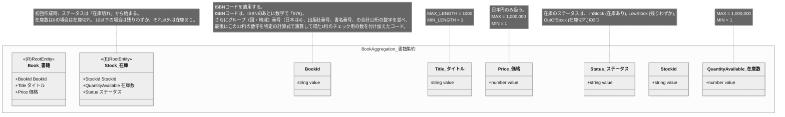

# Book Aggregation (書籍集約)

```mermaid
%%{init:{'theme':'neutral'}}%%

classDiagram
namespace BookAggregation_書籍集約 {
    %% 1. エンティティの定義
    class Book_書籍 {
        <<(R)RootEntity>>
        +BookId BookId
        +Title タイトル
        +Price 価格
    }

    class Stock_在庫 {
        <<(E)RootEntity>>
        +StockId StockId
        +QuantityAvailable 在庫数
        +Status ステータス
    }

    %% 2. 属性の定義
    class BookId {
        string value
    }

    class Title_タイトル {
        string value
    }

    class Price_価格 {
        +number value
    }

    class Status_ステータス {
        +string value
    }

    class StockId {
        +string value
    }

    class QuantityAvailable_在庫数 {
        +number value
    }
}

%% 3. ビジネスルールの追加
note for BookId "
ISBNコードを適用する。
ISBNコードは、ISBNのあとに数字で「978」、
さらにグループ（国・地域）番号（日本は4）、出版社番号、書名番号、の合計12桁の数字を並べ、
最後にこの12桁の数字を特定の計算式で演算して得た1桁のチェック用の数を付け加えたコード。"

note for Title_タイトル "
MAX_LENGTH = 1000
MIN_LENGTH = 1"

note for QuantityAvailable_在庫数 "
MAX = 1,000,000
MIN = 1"

note for Price_価格 "
日本円のみ扱う。
MAX = 1,000,000
MIN = 1"

note for Stock_在庫 "
初回作成時、ステータスは「在庫切れ」から始まる。
在庫数は0の場合は在庫切れ。10以下の場合は残りわずか。それ以外は在庫あり。"

note for Status_ステータス "
在庫のステータスは、 InStock (在庫あり), LowStock (残りわずか),
OutOfStock (在庫切れ)の3つ"
```
