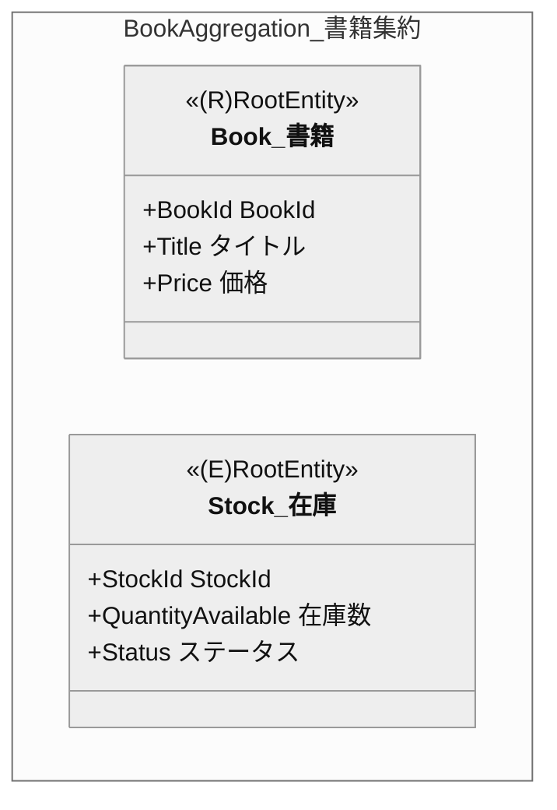

# Book Aggregation (書籍集約)

```mermaid
%%{init:{'theme':'neutral'}}%%

classDiagram
namespace BookAggregation_書籍集約 {
    %% 1. エンティティの定義
    class Book_書籍 {
        <<(R)RootEntity>>
        +BookId BookId
        +Title タイトル
        +Price 価格
    }

    class Stock_在庫 {
        <<(E)RootEntity>>
        +StockId StockId
        +QuantityAvailable 在庫数
        +Status ステータス
    }
}
```
