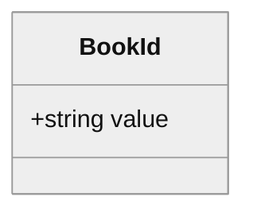

# BookId

```mermaid
%%{init:{'theme':'neutral'}}%%

classDiagram
class BookId {
    +string value
}
```

## ビジネスルール

ISBN コードを適用する。  
ISBN コードは、ISBN のあとに数字で「978」、  
さらにグループ（国・地域）番号（日本は 4）、出版社番号、書名番号、の合計 12 桁の数字を並べ、  
最後にこの 12 桁の数字を特定の計算式で演算して得た 1 桁のチェック用の数を付け加えたコード。"
