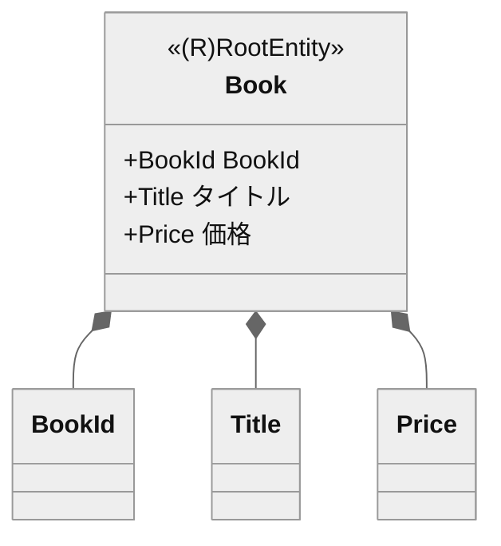

# Book (書籍)

```mermaid
%%{init:{'theme':'neutral'}}%%

classDiagram
class Book {
    <<(R)RootEntity>>
    +BookId BookId
    +Title タイトル
    +Price 価格
}

Book *-- BookId
Book *-- Title
Book *-- Price

link BookId "https://github.com/44103/domain-driven-design/blob/main/StockManagement/Domain/models/Book/BookId/BookId.md" "BookId"
link Title "https://github.com/44103/domain-driven-design/blob/main/StockManagement/Domain/models/Book/Title/Title.md" "Title"
link Price "https://github.com/44103/domain-driven-design/blob/main/StockManagement/Domain/models/Book/Price/Price.md" "Price"
```
