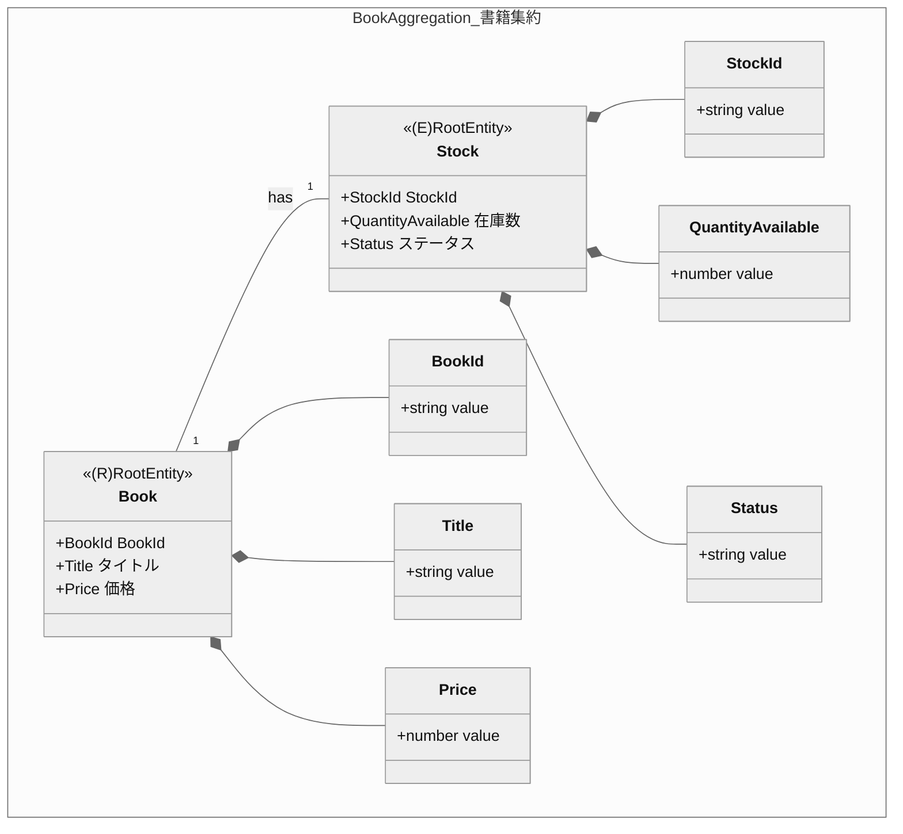

# Book Aggregation (書籍集約)

```mermaid
%%{init:{'theme':'neutral'}}%%

classDiagram
namespace BookAggregation_書籍集約 {
    %% 1. エンティティの定義
    class Book {
        <<(R)RootEntity>>
        +BookId BookId
        +Title タイトル
        +Price 価格
    }

    class Stock {
        <<(E)RootEntity>>
        +StockId StockId
        +QuantityAvailable 在庫数
        +Status ステータス
    }

    %% 2. 属性の定義
    class BookId {
        +string value
    }

    class Title {
        +string value
    }

    class Price {
        +number value
    }

    class Status {
        +string value
    }

    class StockId {
        +string value
    }

    class QuantityAvailable {
        +number value
    }
}

%% 3. ビジネスルールの追加
link Book "https://github.com/44103/domain-driven-design/blob/main/StockManagement/Domain/models/Book/Book.md" "Book (書籍)"
link BookId "https://github.com/44103/domain-driven-design/blob/main/StockManagement/Domain/models/Book/BookId/BookId.md"
link Title "https://github.com/44103/domain-driven-design/blob/main/StockManagement/Domain/models/Book/Title/Title.md"
link Price "https://github.com/44103/domain-driven-design/blob/main/StockManagement/Domain/models/Book/Price/Price.md"

link Stock  "https://github.com/44103/domain-driven-design/blob/main/StockManagement/Domain/models/Book/Stock/Stock.md" "Stock (在庫)"
link StockId "https://github.com/44103/domain-driven-design/blob/main/StockManagement/Domain/models/Book/Stock/StockId/StockId.md"
link QuantityAvailable "https://github.com/44103/domain-driven-design/blob/main/StockManagement/Domain/models/Book/Stock/QuantityAvailable/QuantityAvailable.md"
link Status "https://github.com/44103/domain-driven-design/blob/main/StockManagement/Domain/models/Book/Stock/Status/Status.md"

%% 4. 関連性の定義
Book "1" -- "1" Stock : has

Book *-- BookId
Book *-- Title
Book *-- Price

Stock *-- StockId
Stock *-- QuantityAvailable
Stock *-- Status
```
