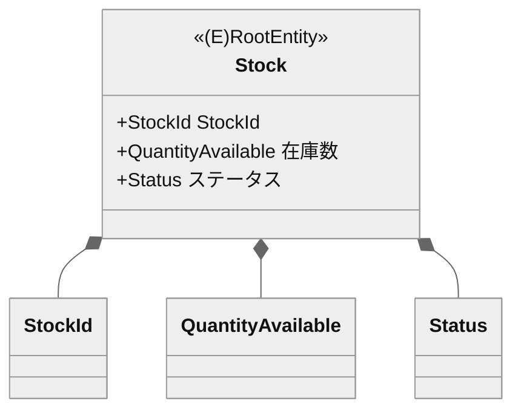

# Stock (在庫)

```mermaid
%%{init:{'theme':'neutral'}}%%

classDiagram
class Stock {
    <<(E)RootEntity>>
    +StockId StockId
    +QuantityAvailable 在庫数
    +Status ステータス
}

Stock *-- StockId
Stock *-- QuantityAvailable
Stock *-- Status

link Status "https://github.com/44103/domain-driven-design/blob/main/StockManagement/Domain/models/Book/Stock/Status/Status.md" "Status"
link QuantityAvailable "https://github.com/44103/domain-driven-design/blob/main/StockManagement/Domain/models/Book/Stock/QuantityAvailable/QuantityAvailable.md" "QuantityAvailable"
link StockId "https://github.com/44103/domain-driven-design/blob/main/StockManagement/Domain/models/Book/Stock/StockId/StockId.md" "StockId"
```

## ビジネスルール

初回作成時、ステータスは「在庫切れ」から始まる。  
在庫数は 0 の場合は在庫切れ。10 以下の場合は残りわずか。それ以外は在庫あり。
